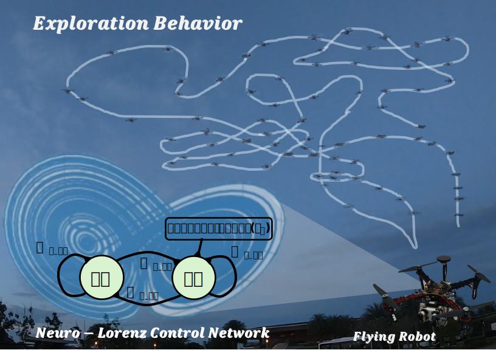
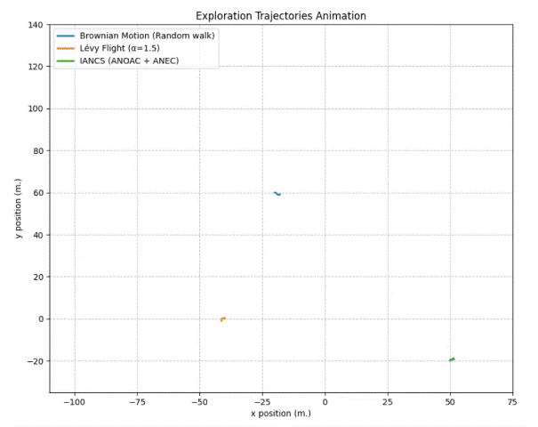
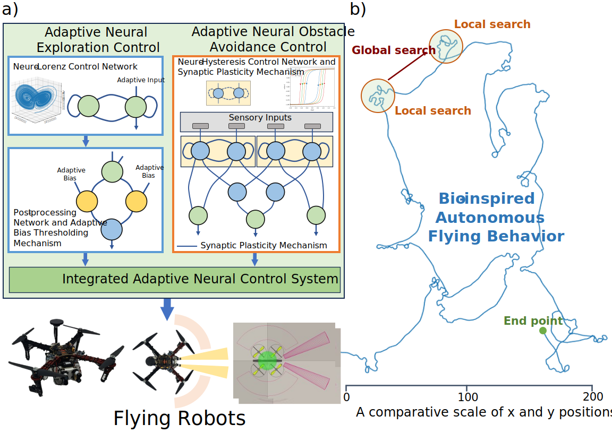

# Neural Dynamics and Synaptic Plasticity in Simple Networks Drive Lévy Flight Foraging and Obstacle Avoidance Behaviors
Animal foraging behavior is essential for survival. This complex behavior involves a combination of local search--seeking food nearby and global search--exploring large areas for new food resources. These strategies can be adaptively alternated. During exploration, animals also navigate obstacles. Several studies have been focused on developing bio-inspired exploration mechanisms for artificial agents, with Lévy flight emerging as one of the most effective methods. However, existing Lévy models rely on mathematical representations of Lévy distributions, which are difficult to directly relate to the biological neural systems of animals. From this perspective, we propose an efficient and adaptive neural exploration control system synthesized from a small recurrent neural network. This network, characterized by its synaptic weights and adaptive inputs, exhibits neural dynamics similar to the discrete-time Lorenz attractor. The network's output provides the baseline input signal for post-processing through an adaptive bias thresholding mechanism, which generates exploration commands. These commands enable adaptive exploration behaviors that incorporate both local and global search strategies.
Additionally, to ensure safe exploration in obstacle-filled environments, we integrate an adaptive neural obstacle avoidance control into the system. We assessed the performance of the proposed system in both open and closed environments using simulated and real flying robots. The resulting flight trajectories demonstrate animal-like foraging behaviors, including local and global search strategies similar to Lévy flight, along with adaptive obstacle avoidance capabilities.
   

   
    
   <em>Figure 1: The graphical abstract highlights the main contribution of this work by illustrating the neuro-Lorenz control network (NLCN) in the form of a two-neuron recurrent network. This network functions as an internal driving system that generates a baseline signal exhibiting discrete-time Lorenz attractor-like neural dynamics. The signal is then post-processed to generate exploration control commands for the flying robot, enabling complex exploration behaviors comparable to Lévy flight foraging.</em>

<bv>  
   

   
    
   <em>Figure 2: Comparison of flying trajectories among three exploration control strategies: Brownian motion (Random walk, depicted in blue), Lévy flight (depicted in orange), and IANCS (ANOAC + ANEC, depicted in green).</em>

 

## Integrated Adaptive Neural Control System (IANCS)
This work presents an Adaptive Neural Exploration Control (ANEC) system for autonomous flying robots as an alternative to conventional Lévy flight-based models. At its core is a compact recurrent neural network, the Neuro-Lorenz Control Network, which generates discrete-time Lorenz attractor-like neural dynamics. These dynamics drive adaptive exploration behaviors via an adaptive bias thresholding mechanism, enabling both local and global search strategies.
To support safe navigation, the system incorporates an enhanced Adaptive Neural Obstacle Avoidance Control (ANOAC), referred to as the Neuro-Hysteresis Control Network. This updated module improves upon prior work by integrating lateral-surrounding sensors and a synaptic plasticity mechanism to increase obstacle avoidance adaptability during exploration.
The full Integrated Adaptive Neural Control System (IANCS) was implemented and tested on both simulated and real drones, demonstrating its effectiveness in both obstacle-free and obstacle-filled environments.
 

   
    
   <em>a) The overall integrated neural system for adaptive exploration and obstacle avoidance neural controls facilitates adaptive exploration and obstacle avoidance behaviors in an autonomous flying robot. This neural control system consists of two main modules: the Adaptive Neural Exploration Control (ANEC) module and the Adaptive Neural Obstacle Avoidance Control (ANOAC) module. The ANEC module (blue edge) utilizes the Neuro-Lorenz Control Network (NLCN) along with the adaptive bias thresholding mechanism in the post-processing network to generate adaptive exploration commands. The ANOAC module (orange edge) employs two Neuro-Hysteresis Control Networks (NHCNs), which incorporate synaptic plasticity mechanisms to generate adaptive obstacle avoidance commands. The outputs of these two modules are integrated (green box) and work synergistically to generate final control commands, which are transmitted to the flying robot. b) Tracking the trajectory when the robot is flying in an open area, exhibiting both global and local search patterns in its flight path. </em>

 
If you have any questions, [vatsanai.j_s18@vistec.ac.th](mailto:vatsanai.j_s18@vistec.ac.th).

